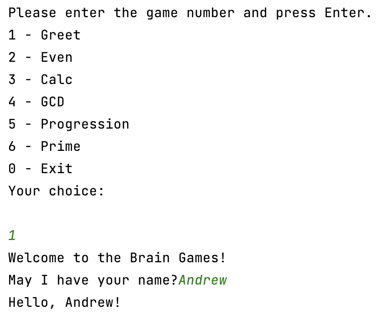
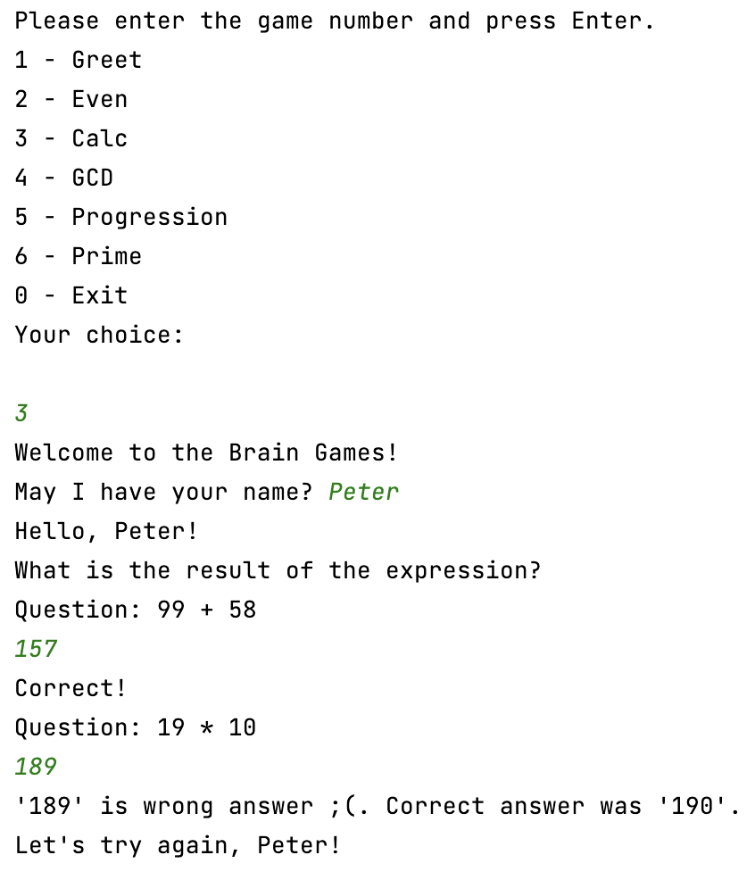
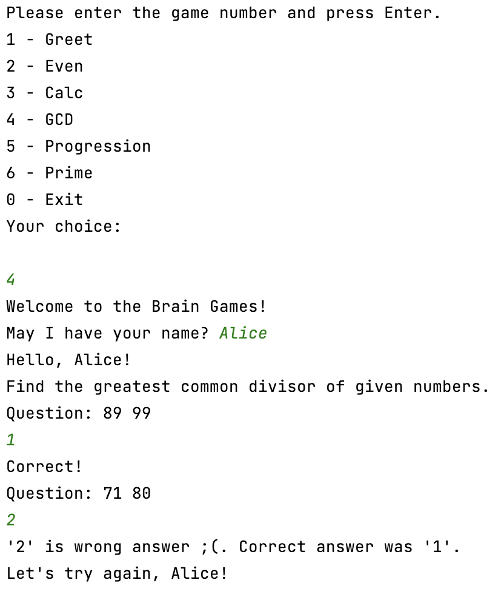
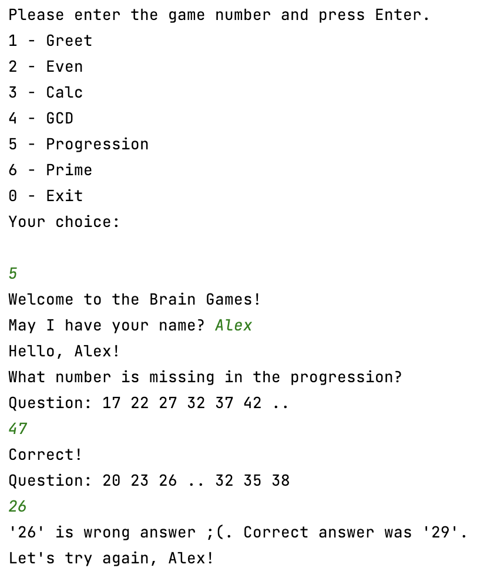
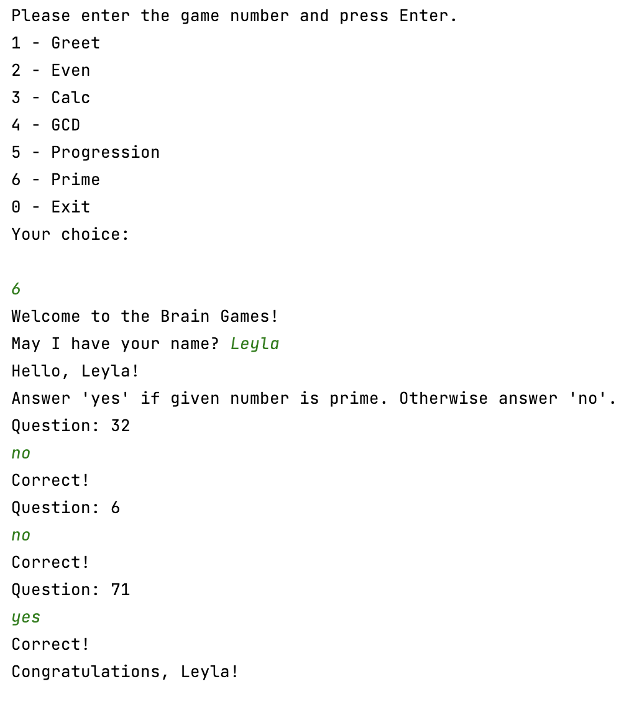

### Hexlet tests and linter status:
[](https://github.com/honest-niceman/java-project-61/actions)
[](https://codeclimate.com/github/honest-niceman/java-project-61/maintainability)

# Mind-Games

Mind Games - a set of five console games. Each game asks questions that need to be answered correctly. After three correct answers, the game is considered to be completed. Wrong answers end the game and offer to play it again. Games:

– Even. Define whether number is even or odd.
- Calculator. Evaluate arithmetic expressions.
- GCD. Find the Greatest Common Divisor.
- Progression. Search missing numbers in a sequence.
- Prime. Define whether number is prime or not.

## How to Run
```sh
   make run-dist
```

## Gameplay

### Greet



### Even


### Calculator



### GCD



### Progression



### Prime


